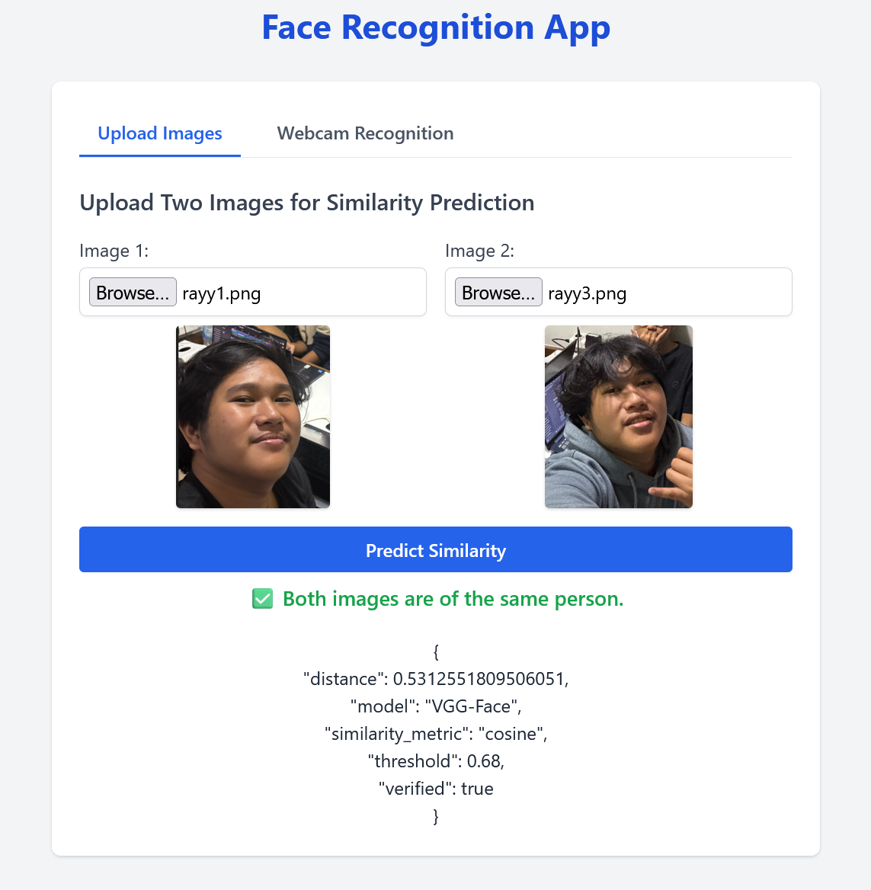
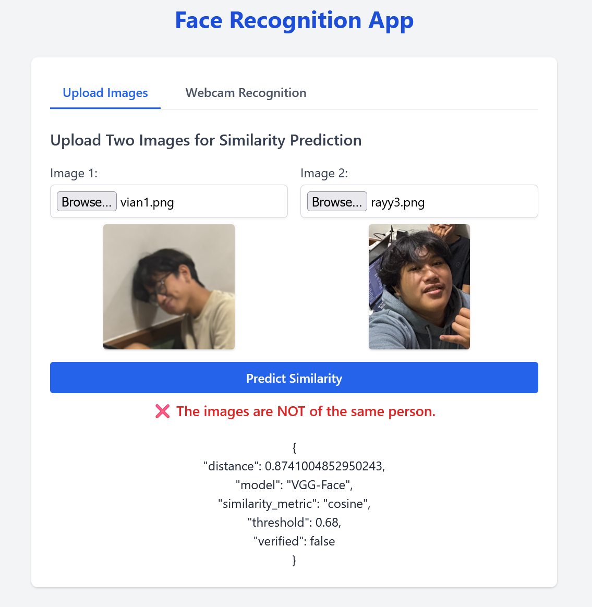
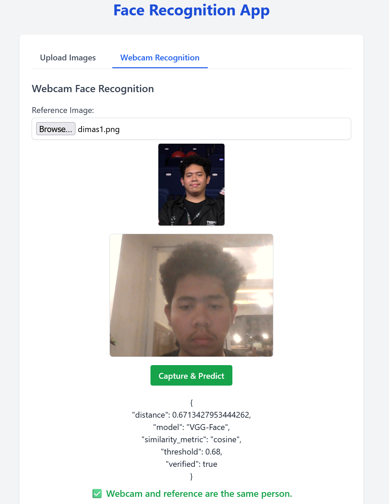
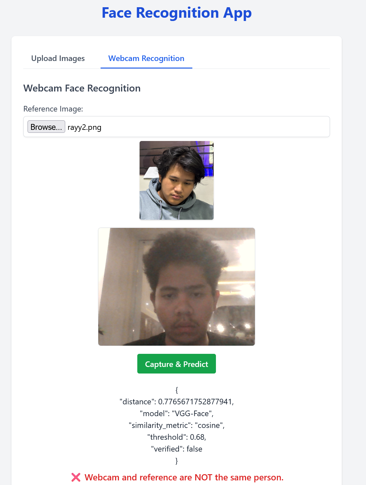

# Face Recognition FP AI Kelas B

Anggota Kelompok:

- Dimas Andhika Diputra 5027231074
- Danendra Fidel Khansa 50272310xx

## Project Structure

```
face-recogntion-fp-ai
├── app.py
├── requirements.txt
├── static
│   ├── css
│   │   └── tailwind.css
│   └── js
│       └── webcam.js
├── templates
│   ├── index.html
│   └── layout.html
└── README.md
```

## Installation

1. Buat virtual environment (menghindari package conflict):

   ```
   python -m venv venv
   source venv/bin/activate  # On Windows use `venv\Scripts\activate`
   ```

2. Install package yang diperlukan:
   ```
   pip install -r requirements.txt
   ```

## Usage

1. Jalankan aplikasi flask:

   ```
   python app.py
   ```

2. Buka browser dan buka url: `http://127.0.0.1:5000`.

3. Tab pertama untuk fitur prediksi wajah dengan mengupload 2 gambar.

4. Tab kedua untuk fitur prediksi wajah dengan 1 referensi gambar dan 1 webcam.

### First tab

<div style="display: flex; gap: 10px;">
  
  
</div>

### Second Tab

<div style="display: flex; gap: 10px;">
  
  
</div>
